[简体中文](./README.md) · [Website](https://hflock.lei6393.com) · [GitHub](https://github.com/SuperMarioYL/hflock)

<picture>
  <source media="(max-width: 600px) and (prefers-color-scheme: dark)" srcset="./assets/presentation/hero-mobile-dark.svg">
  <source media="(max-width: 600px)" srcset="./assets/presentation/hero-mobile-light.svg">
  <source media="(prefers-color-scheme: dark)" srcset="./assets/presentation/hero-dark.svg">
  
</picture>

# hflock

**Give downloaded model files a checkable manifest.**

hflock reads a YAML list of repositories, revisions and files, downloads those files, and writes a JSON manifest containing their hashes and sizes.

## Why use it

A model download is hard to reproduce when the chosen revision and exact bytes are undocumented. Store the requested files in a lockfile and retain the generated hash manifest alongside your build.

- **Declare the input** — Keep repository, revision and filenames in YAML.
- **Record exact bytes** — Each download yields a SHA256 digest and byte count.
- **Reproduce offline** — The bundled HTTP fixture exercises the download and hashing path.

## Architecture

<picture>
  <source media="(max-width: 600px) and (prefers-color-scheme: dark)" srcset="./assets/presentation/architecture-mobile-dark.svg">
  <source media="(max-width: 600px)" srcset="./assets/presentation/architecture-mobile-light.svg">
  <source media="(prefers-color-scheme: dark)" srcset="./assets/presentation/architecture-dark.svg">
  
</picture>

The lockfile loader validates the request. The Hugging Face source resolves explicit filenames or globs and streams downloads through a SHA256 hasher into a local cache. The verifier writes repository, revision, path, size and digest to the manifest. It does not compare that digest with a trusted baseline.

| Component | Responsibility |
| --- | --- |
| `YAML lockfile` | internal/lockfile |
| `HF source` | internal/mirror/hf.go |
| `Download + SHA256` | internal/verify/verify.go |
| `JSON manifest` | Hash entries and sizes |

## Install and quickstart

Build with the version declared in the repository manifest. Run the example from the repository root.

```bash
git clone https://github.com/SuperMarioYL/hflock.git
cd hflock
go build ./cmd/hflock
```

The Python example serves examples/fixture on loopback, runs the real verify command and prints each generated hash. It stops the server and removes its temporary cache on exit.

```bash
python3 examples/presentation-demo.py
```

## Recorded demo

<picture>
  <source media="(max-width: 600px) and (prefers-color-scheme: dark)" srcset="./assets/presentation/process-mobile-dark.svg">
  <source media="(max-width: 600px)" srcset="./assets/presentation/process-mobile-light.svg">
  <source media="(prefers-color-scheme: dark)" srcset="./assets/presentation/process-dark.svg">
  
</picture>

Nine fixture files produce nine SHA256 entries; no mirror upload is attempted.

```text
source: local fixture; uploaded files: 0
deepseek-ai/DeepSeek-V3 config.json 146 b6c28b2ff63b535e4c3f1bac57c7da944ca8c098fbfab51befbd67d8b1ce59c7
deepseek-ai/DeepSeek-V3 generation_config.json 72 6d9c0a68128352b855b24b93d26cc6cb682de94fbe3bd5476cc548d76fbde572
deepseek-ai/DeepSeek-V3 tokenizer.json 121 2d162ff88f4721aaab432337fe7684c99b524f7b9ed12a96bac105471a8cdec0
Qwen/Qwen3-235B-A22B config.json 136 477797cbaa2e203b12b887f4dd0d50837f1083fb8c96614c60dc0a68e341ba51
Qwen/Qwen3-235B-A22B generation_config.json 72 6bdf409035dea3029e9f60144e1456598aa47d837381c524b441708ccafcb798
Qwen/Qwen3-235B-A22B tokenizer.json 118 8a9ebf95154a697efaf420257b2b31d198c8e81b840012f2aa170b38c6771677
THUDM/glm-4-9b-chat config.json 133 1227daa941278aa954f4e005cb4eed01af781ed2af76e539021fabb2faf34129
THUDM/glm-4-9b-chat generation_config.json 72 e06ed109d9bfa5faf7f3fedc0cc895d1fde272744ec9df0ccb13286fb28ce8ab
THUDM/glm-4-9b-chat tokenizer.json 117 35f88f9c371cb02c189d4f02a433629e028fc0f4f18f7d420ead0fef653edd2e
hashed files: 9
```

The complete command and output are recorded in [docs/demo-results.json](./docs/demo-results.json). Inputs and reproduction code are included in the repository.


The existing recording is retained for context; the text example above documents the reproducible scenario.

## Usage

The CLI exposes the following operations. Commands after the example use your own paths or identifiers.

```bash
go run ./cmd/hflock verify examples/weights.lock.yaml --manifest weights.lock.manifest.json
# Use your own lockfile for actual downloads:
hflock verify weights.lock.yaml --progress
```

## Configuration

--hf-base or HFLOCK_HF_BASE selects the HTTP source. --workdir or HFLOCK_WORKDIR selects the download cache. --manifest/-m selects the output file; --progress enables per-file progress. The example starts a loopback fixture server and uses a temporary cache.

## Integrations and responsibilities

<picture>
  <source media="(max-width: 600px) and (prefers-color-scheme: dark)" srcset="./assets/presentation/integrations-mobile-dark.svg">
  <source media="(max-width: 600px)" srcset="./assets/presentation/integrations-mobile-light.svg">
  <source media="(prefers-color-scheme: dark)" srcset="./assets/presentation/integrations-dark.svg">
  
</picture>

The following routes are implemented in the source. Choose the input that matches your task and keep the resulting artifact with your project.

| Route | Implemented role |
| --- | --- |
| YAML | Repository/revision/file selection |
| Hugging Face HTTP | Download source |
| Loopback fixture | Offline reproduction |
| JSON manifest | SHA256 and byte counts |

## Limits and next steps

- The demo hashes nine small metadata fixtures, not production weights. It performs no remote uploads.
- init, sync and list are not implemented. Gitee AI and ModelScope mirroring remain roadmap items.
- A newly computed digest records received bytes; it does not establish upstream authenticity or verify an expected digest. Use immutable revisions when reproducibility matters.

Mirror uploads, lockfile generation and comparison against an existing trusted manifest are future work.

## License and contributions

See [LICENSE](./LICENSE). When reporting an issue, include a minimal input, the command, and the observed output.
