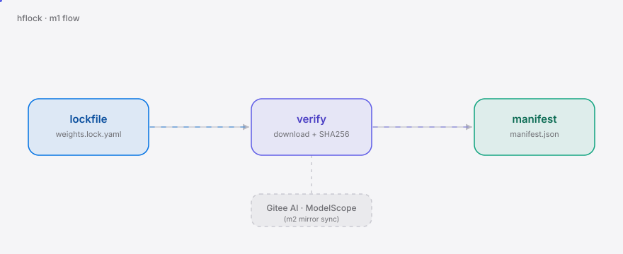
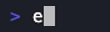

<div align="right"><sub><b>English</b>&nbsp;&nbsp;⇄&nbsp;&nbsp;<a href="./README.md">简体中文</a></sub></div>

<picture>
  <source media="(prefers-color-scheme: dark)" srcset="./assets/hero-dark.svg">
  <source media="(prefers-color-scheme: light)" srcset="./assets/hero-light.svg">
  
</picture>

<p align="center"><sub>A CLI that mirrors and hash-verifies CN model weights — pinning DeepSeek/Qwen/GLM weights from Hugging Face to Gitee AI/ModelScope with a machine-checkable SHA256 provenance manifest.</sub></p>

<p align="center">
  <a href="./LICENSE"></a>
  <a href="https://github.com/SuperMarioYL/hflock/releases"></a>
  
  
</p>

<p align="center"><b>Every CI pull of DeepSeek weights is a bet that the GFW and Hugging Face won't break — hflock pins the mirror, the hash, and the rebuildability into Git with one lockfile.</b></p>

<h2> Architecture</h2>

<picture>
  <source media="(prefers-color-scheme: dark)" srcset="./assets/atlas-dark.svg">
  <source media="(prefers-color-scheme: light)" srcset="./assets/atlas-light.svg">
  
</picture>

<p>v0.1 (m1) wires only the blue and purple segments: <b>lockfile → download from Hugging Face → recompute SHA256 → write <code>weights.lock.manifest.json</code></b>. That manifest is the provenance record a CI air-gap gate can fail on. Mirroring to Gitee AI + ModelScope lands in m2 (the dashed node).</p>

## Contents

- [Why hflock](#why-hflock)
- [Install & Quickstart](#install--quickstart)
- [Usage](#usage)
- [Demo](#demo)
- [Configuration](#configuration)
- [Comparison](#comparison)
- [Roadmap](#roadmap)
- [Paid · Hosted tier](#paid--hosted-tier)
- [License](#license)

## Why hflock

CN AI/dev-ops engineers pin production builds to DeepSeek, Qwen, and GLM weights whose only canonical source is Hugging Face — reachable from inside the GFW through a reverse proxy with **no SLA and no provenance** (hf-mirror.com), or through ModelScope, which mirrors a **lagging, partial subset**. Neither lets you prove to an auditor or a CI gate that "these bytes are correct and rebuildable."

hflock turns that into a declarative lockfile: you commit <code>weights.lock.yaml</code> pinning repo@revision + files, and <code>hflock verify</code> downloads from Hugging Face, recomputes each file's SHA256, and writes a machine-checkable manifest. Provenance is verifiable before any mirror exists — which is exactly why m1 ships it first.

<h2> Install & Quickstart</h2>

One static binary, no Python runtime. Cold clone to first visible result, three commands, fully offline (a bundled fixture stands in for Hugging Face):

```bash
git clone https://github.com/SuperMarioYL/hflock && cd hflock
go build -o hflock ./cmd/hflock
python3 -m http.server 8053 --directory examples/fixture & \
  HFLOCK_HF_BASE=http://localhost:8053 ./hflock verify examples/weights.lock.yaml
```

<details><summary>Sample output (weights.lock.manifest.json)</summary>

```json
{
  "lock_version": "0.1.0",
  "generated_at": "2026-08-27T16:36:17Z",
  "entries": [
    { "repo": "deepseek-ai/DeepSeek-V3", "revision": "v3.0", "file": "config.json", "sha256": "b6c28b2f…", "size": 146 },
    { "repo": "Qwen/Qwen3-235B-A22B", "revision": "main", "file": "tokenizer.json", "sha256": "8a9ebf95…", "size": 118 }
  ]
}
```
</details>

> Against real Hugging Face (downloads the real large weights): `go install github.com/SuperMarioYL/hflock@latest`, drop `HFLOCK_HF_BASE`, and run `hflock verify weights.lock.yaml` directly.

<h2> Usage</h2>

Write a `weights.lock.yaml` pinning the CN weights your CI depends on:

```yaml
version: "0.1.0"
weights:
  - repo: deepseek-ai/DeepSeek-V3
    revision: v3.0
    files: ["config.json", "*.safetensors"]   # globs expand via the HF file-tree API at verify time
    source: huggingface
```

Verify and emit the provenance manifest (the m1 core):

```bash
hflock verify weights.lock.yaml                       # → weights.lock.manifest.json
hflock verify weights.lock.yaml -m ci/manifest.json   # explicit output path
hflock verify weights.lock.yaml --progress            # progress bar for large files
```

CI air-gap gate: commit the manifest to the repo; the next `hflock verify` recomputes hashes and diffs against it to pass/fail (m3's `--check` gives a standard exit code).

Full example at [`examples/weights.lock.yaml`](./examples/weights.lock.yaml).

<h2> Demo</h2>

<p>The full flow — lockfile to SHA256 provenance manifest — against the offline fixture:</p>

<p align="center"></p>

<p align="center"><sub>Full terminal recording: <a href="./assets/demo.cast">asciinema cast</a> · script: <a href="./docs/demo.tape">docs/demo.tape</a></sub></p>

<h2> Configuration</h2>

| Flag / env | Type | Default | Meaning |
| --- | --- | --- | --- |
| `--hf-base` / `HFLOCK_HF_BASE` | string | `https://huggingface.co` | Hugging Face source URL; override for the offline fixture or a self-hosted endpoint |
| `--workdir` / `HFLOCK_WORKDIR` | path | system temp | download cache dir |
| `--manifest` / `-m` | path | `weights.lock.manifest.json` | manifest output path |
| `--progress` | bool | `false` | show a per-file download progress bar |

## Comparison

| Axis | hflock | hf-mirror.com | ModelScope | huggingface-cli |
| --- | :---: | :---: | :---: | :---: |
| Declarative pin (lockfile in Git) | ✓ | ✗ | ✗ | ✗ |
| Multi-mirror (Gitee + ModelScope, concurrent) | ✓ (m2) | ✗ (single proxy) | ✗ (single platform) | ✗ |
| Hash-provenance manifest (CI-checkable) | ✓ | ✗ | ✗ | partial (needs hand-rolled sha256sum) |
| Hosted stability / SLA | ✗ (OSS, self-hosted) | ✗ (community proxy) | ✓ (Alibaba-hosted) | — |
| Zero-config, ready to go | ✗ (needs a lockfile) | ✓ | ✓ | ✓ |

Honest: for SLA and zero-config, ModelScope or hf-mirror are better today. hflock's edge is the **declarative pin + verifiable provenance** that nobody else does.

<h2> Roadmap</h2>

- [x] **m1 — lockfile + hash verify**: `WeightLock` parse/validate + SHA256 verification, `hflock verify` emits the provenance manifest (this release)
- [ ] **m2 — mirror sync**: `hflock sync` reads the lockfile, downloads from Hugging Face, uploads to Gitee AI + ModelScope concurrently/resumably, then verifies
- [ ] **m3 — init + CI gate**: `hflock init` generates a lockfile from HF repo refs; `hflock list` per-weight status table; `--check` exit codes for CI air-gap gates; the full demo tape
- [ ] Future: incremental sync, sigstore-signed provenance, Baidu Wangpan / Aliyun OSS mirrors

## Paid · Hosted tier

v0.1 ships only the OSS engine (MIT) and sells nothing. But the commercial path is real, and stated here so you don't have to ask:

- **Who pays**: CN ML platform teams and compliance roles at regulated industries (finance / government) who need a "data does not leave the country" attestation an auditor will accept.
- **What they buy**: a hosted mirror with an SLA plus signed (sigstore) provenance reports — the surface the v0.1 OSS engine proves out, with an operating layer on top.
- **Price band**: roughly ¥3k–8k / month / team (below one SRE's self-hosting cost).
- **Smallest loop**: the OSS CLI lands an inbound from a compliance team → v0.2 opens a hosted tier on Aliyun (ECS + OSS for weights) + billing → one signed provenance PDF per pinned weight set.
- **Honest gate**: no paid tier ships until v0.1 hits day-30 indicators (≥100 stars, ≥10 active users) — a commercial surface with no OSS traction is just an invoice.

<h2> License</h2>

MIT, see [LICENSE](./LICENSE). Issues and PRs welcome — especially Gitee AI / ModelScope upload implementations (m2).

<p align="center"><sub><a href="./LICENSE">MIT</a> © 2026 SuperMarioYL</sub></p>
